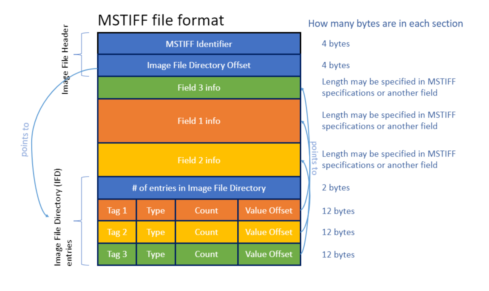
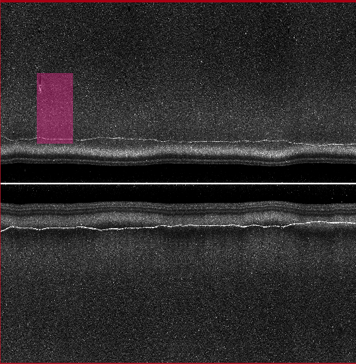

# NavalDataAnalyticsPlatform

## Research Project Overview: 
Underwater Unmanned Vehicles (UUVs) are often used to collect sonar data, which uses reflections of acoustic waves off of features on the sea floor to construct images. Additional data can also be collected by various sensors in the UUV, including location, depth of the vehicle, and timestamp, among other information. Identifying underwater mines is one major application for this dataset. Currently, the data can only be manually downloaded once the UUV mission is complete, and trained operators must then manually look through the images using vendor-provided software. After this process measures can be taken to disable the mines before they detonate. However, using data processing and analysis techniques, it is possible to build a portable Distributed Data Analytics Platform (DiDAP) to automatically identify potential mine locations, saving valuable time for those working to remove the hazards. Our project involved extracting image and meta data from the MSTIFF file, applying machine learning techniques to identify potential mines, developing a distributed data storage and processing platform with Hadoop, and displaying results for end users with a GUI. The schematics of the process are shown below.

### MSTIFF Data:
The data collected from the side-scan sonar attached to the UUV is stored in a binary file format called the Marine Sonic Technology Ltd. Image File Format (MSTIFF). This file format is structurally similar to the Tagged Image File Format (TIFF) in that it contains an image file header, an image file directory (IFD), and image data as well as metadata scattered throughout the file. Using a Java program to follow the tags as necessary through the IFD, various metadata fields were traced, converted, and recorded into a comma-separated value (CSV) file. This data included timestamp information, navigational latitude and longitude, water depth, towfish depth and date and time data for the sonar image. A series of transformations between Hexadecimal, binary arrays, and other data types is required to extract the final data values. 

### Labelling Mines:
Once sonar data is extracted and reconstructed as an image, the images are processed and labelled with potential mine locations in a process called Cluster-Oriented Search Mine Identification Complex (COSMIC). Sonar images are processed by separating the image into small square frames that cover the whole image. Each individual frame is then scanned for potential mines. Due to the nature of the sonar image, mine-like objects will have various distinctive features; most notably, there should be a bright highlight region where the mine is located, as well as a corresponding shadow region. To find these features, the first search iteration tags frames of interest with dark spots, followed by a second iteration tagging frames of interest with bright spots. Frames which have been labelled with both dark and bright spots are then marked as potentially containing mines.
COSMIC uses an ensemble of algorithms in order to identify dark and bright spots within each frame. When analyzing a frame, the program first applies a k-means clustering algorithm to separate the frame’s pixels into clusters of luminosity. K-means clustering uses the location and luminosity of each individual pixel and an iterative assignment process to group together pixels of similar brightness and close proximity. The cluster with the darkest or brightest collection of pixels is then selected for the next portion of the code. At this point, a density-based spatial clustering of applications with noise (DBSCAN) algorithm is employed. DBSCAN works to group pixels based primarily on relative distances, which reduces the noise in the cluster determined by the previous step. After applying both clustering algorithms, the highlight and the shadow of the mine are likely to be near the corresponding centroids. The highlight is then used to visually generate a box around the mine.

### Scaling Up:
While the algorithms described thus far effectively extract relevant data and identify potential mines, each step of processing the individual files is time consuming. Finding ways to more efficiently handle large volumes of data is central to providing a feasible alternative to the vendor software and manual location of mines. To manage large quantities of data, one useful software framework is Hadoop, an open-source framework for storing data and running applications on clusters of commodity hardware. It provides massive storage for any kind of data and enormous processing power, which allows for parallel computation and provides the building blocks for hosting DiDAP.
Apache Hive is a distributed data warehouse system that enables data analytics at a massive scale, another system that ties in with the intent of “scaling up” the sonar processing algorithms. Hive is built on top of and closely integrated with Hadoop, designed to work quickly on petabytes of data. Hive is unique in that it provides batch processing to work quickly across extensive collections of data queried from a distributed storage system. Apache Sqoop is another part of the Hadoop ecosystem, which provides the tools for the efficient transfer of data from Hadoop to a relational database, and vice versa. With DiDAP, data is stored within the Hadoop architecture using Hive and accessed in batches through an Oracle Database with Sqoop.

### User Interface:
The full sonar data analytics and storage platform is wrapped in a Graphical User Interface (GUI), using Oracle Application Express (APEX), a professional web application development software. APEX allows for the creation of customized applications that interact with the loaded data. For the mine identification application, the GUI gives end users the ability to see markers pinned at the geographic coordinates of the potential mine locations. 

### Conclusion:
The usage of Hive, Hadoop, Sqoop, and Oracle Database allows for a structured process in handling the new newly generated metadata and reconstructed images from the collected MSTIFF Files. Hadoop not only offers advantages for the data analytics platform from the software side, but also on the hardware side as well. By setting up a Hadoop cluster, with Redhat Linux, DiDAP can be packaged onto a pelican case server for easy use and transport.

### Future Work:
The work documented thus far has been focusing on the process pieces that have been developed. Various essential components of the project have been developed, including the algorithms for data processing and mine identification in images as well as the framework for distributed processing of large amounts of data and end user interaction. 
Currently, the integration of some pieces has created a streamlined program to read in MSTIFF files, extract metadata and image data, output potential mine locations, and store data within a local database structure. The algorithm for extracting metadata has been modified to function within the Hadoop architecture as well. However, there has been limited progress on outputting an image along with the metadata due to file type incompatibility.
Integration of all outlined algorithms into the larger scale application is still in progress, and work towards the target outcome of a functional, distributed processing platform to extract and label mine data is continuing. In addition, DiDAP will be built to provide the user multiple options for datasets, and incorporate relevant analysis of other large datasets available within the Department of Defense. In this way, DiDAP will support numerous aspects of military operation.
